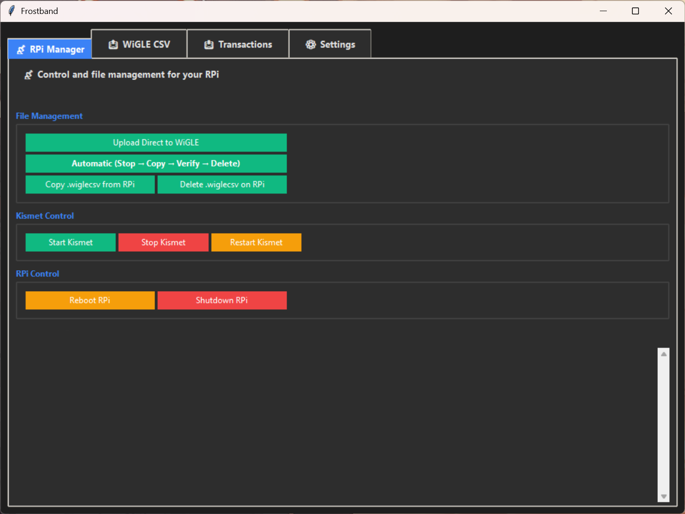
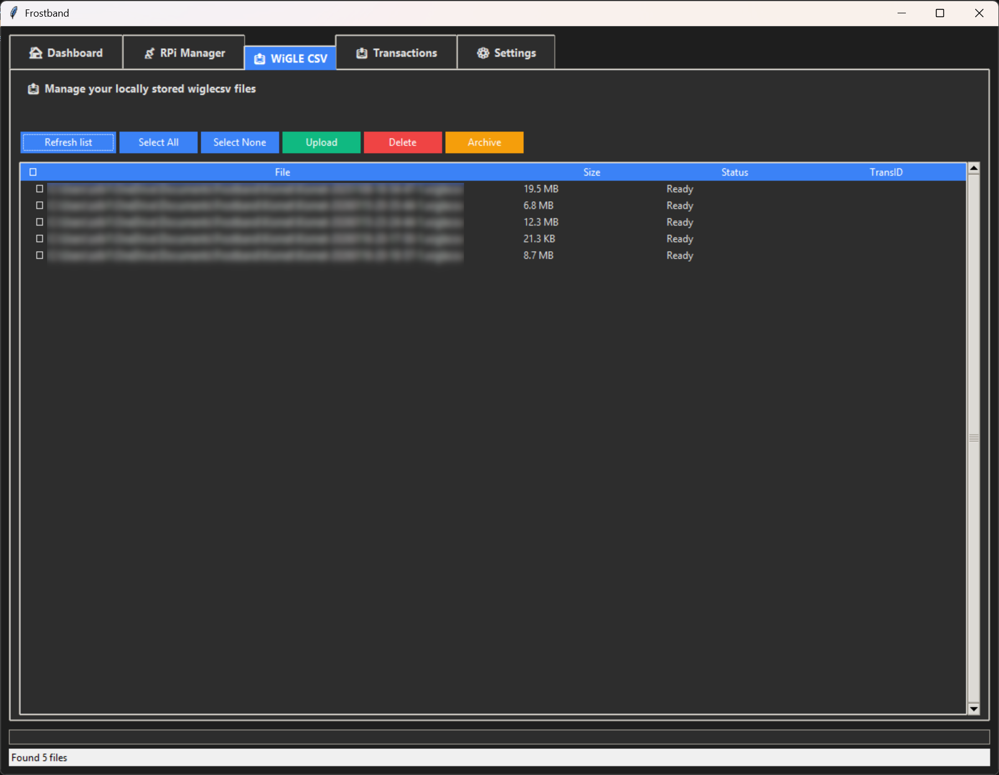
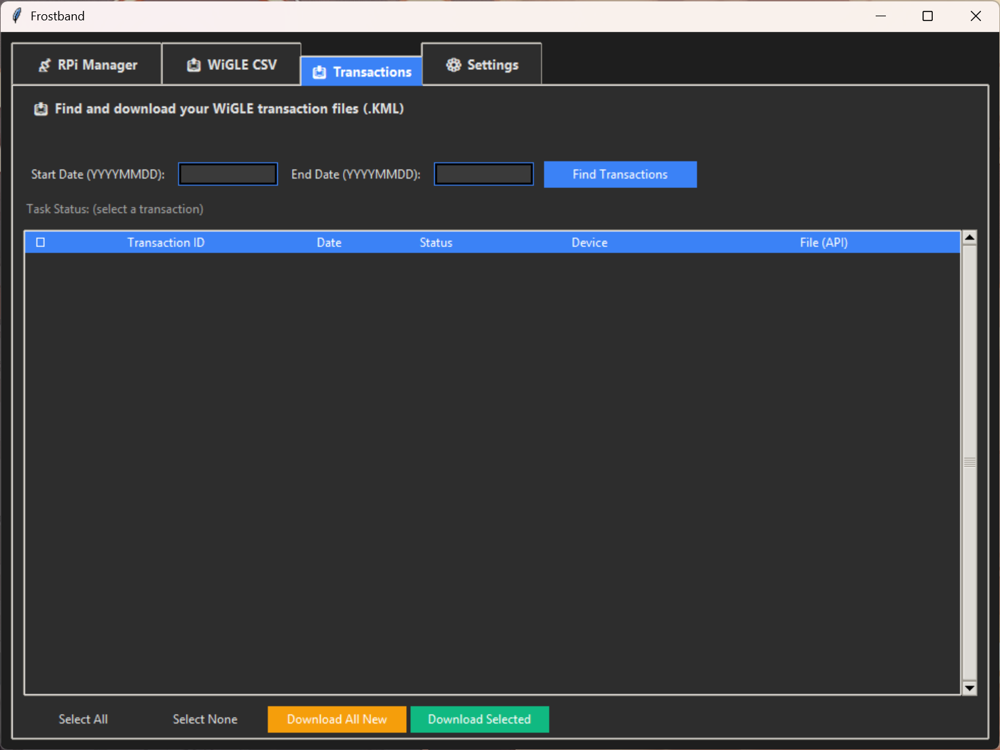
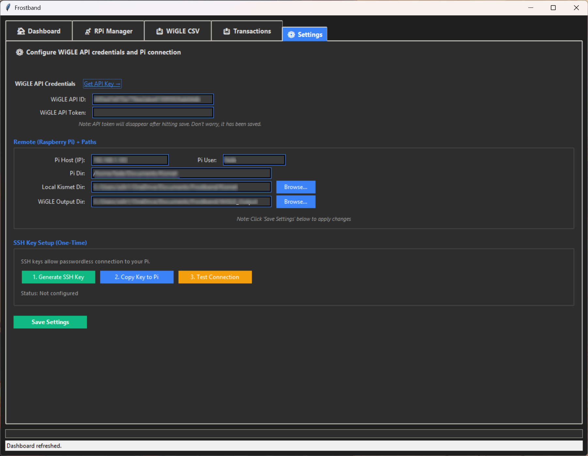

# Frostband

A modern, cross-platform wardriving management tool for Kismet and WiGLE with a sleek dark mode interface.


## Features

### 📡 Raspberry Pi Management
- **Automated workflow**: Stop Kismet → Copy files → Verify integrity → Delete from Pi
- **Direct WiGLE upload**: Upload files from Pi to WiGLE without local storage
- **Remote control**: Start/Stop/Restart Kismet service
- **System control**: Reboot or shutdown your Pi remotely
- **File management**: Copy or delete .wiglecsv files from your Pi

### 📤 Local File Management
- Upload .wiglecsv files to WiGLE
- Archive files locally
- Batch operations with checkboxes
- Real-time upload progress tracking

### 📥 WiGLE Transactions
- Search transactions by date range
- Download KML files for mapping
- Track download status
- Bulk download operations

### ⚙️ Easy Configuration
- Encrypted credential storage (Windows DPAPI / Fernet)
- One-click SSH key setup
- Automatic connection testing
- Dark mode interface with color-coded buttons

## Screenshots

### RPi Manager (Default View)


### WiGLE CSV Upload


### Transaction Downloads


### Settings & Configuration


## Installation

### Prerequisites
- **Python 3.8 or higher**
- **SSH client** (OpenSSH - usually pre-installed on Windows 10/11 and Linux)
- **WiGLE account** with API credentials ([Get them here](https://wigle.net/account))

### Install Dependencies

```bash
pip install -r requirements.txt
```

### Run the Application

```bash
python frostband.py
```

## Building Standalone Executable (Windows)

For Windows users who want a standalone .exe file:

```bash
pip install pyinstaller
python -m PyInstaller --onefile --windowed --name Frostband --icon=frostband.ico frostband.py
```

The executable will be created in the `dist/` folder.

## First-Time Setup

### 1. Configure WiGLE API
1. Go to the **Settings** tab
2. Click "Get API Key →" to open WiGLE account page
3. Copy your API Name and Token
4. Paste into Frostband and click "Save Settings"

### 2. Configure Raspberry Pi Connection
1. Enter your Pi's IP address
2. Enter your Pi username (usually `pi`)
3. Enter the directory where Kismet stores files (e.g., `/home/pi/kismet`)
4. Click "Save Settings"

### 3. Set Up SSH Keys (Recommended)
The app includes automatic SSH key setup for passwordless authentication:

1. Click **"1. Generate SSH Key"** - Creates a new SSH key pair
2. Click **"2. Copy Key to Pi"** - Uploads your key to the Pi (enter password once)
3. Click **"3. Test Connection"** - Verifies everything works

If automatic setup doesn't work, manual instructions will be provided.

### 4. Configure Local Directories
- **Local Kismet Dir**: Where .wiglecsv files are stored on your PC
- **WiGLE Output Dir**: Where downloaded KML files are saved

Use the "Browse..." buttons to select folders easily.

## Usage

### Automatic Workflow (Recommended)
On the **RPi Manager** tab, click **"Automatic (Stop → Copy → Verify → Delete)"**:
- Stops Kismet on your Pi
- Copies all .wiglecsv files to your PC
- Verifies file integrity with SHA-256 hashes
- Deletes files from Pi only if verification passes

### Upload to WiGLE
1. Go to **WiGLE CSV** tab
2. Click "Refresh list" to see your local files
3. Check the files you want to upload
4. Click "Upload"

### Download WiGLE Transactions
1. Go to **Transactions** tab
2. Enter date range (YYYYMMDD format)
3. Click "Find Transactions"
4. Select transactions and click "Download Selected"

## Configuration Files

Settings are stored in:
- **Windows**: `%APPDATA%\Frostband\frostband_config.json`
- **Linux**: `~/.config/Frostband/frostband_config.json`

API tokens are encrypted using:
- **Windows**: DPAPI (Data Protection API)
- **Linux**: Fernet symmetric encryption

## Troubleshooting

### SSH Connection Issues
- Ensure OpenSSH client is installed
- Verify Pi is reachable on the network (`ping <pi-ip>`)
- Check that SSH is enabled on your Pi
- Use "Test Connection" in Settings to diagnose

### WiGLE Upload Failures
- Verify API credentials are correct
- Check internet connection
- Ensure .wiglecsv files are valid Kismet output

### Missing Dependencies
```bash
pip install --upgrade -r requirements.txt
```

## Development

### Project Structure
```
Frostband/
├── frostband.py          # Main application
├── frostband.ico         # Application icon
├── requirements.txt      # Python dependencies
├── README.md            # This file
└── .gitignore           # Git ignore rules
```

### Contributing
Contributions are welcome! Please feel free to submit a Pull Request.

## Credits

Developed for the wardriving community. Built with:
- Python & tkinter for the GUI
- Requests for API communication
- Cryptography for secure credential storage

## License

MIT License - see LICENSE file for details

## Support

For issues, questions, or suggestions, please open an issue on GitHub.

---

**Happy Wardriving! 📡**